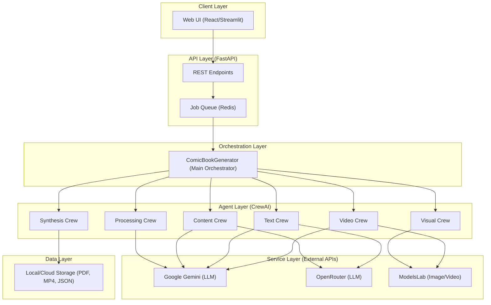

# Architecture Pattern: Multi-Agent Pipeline Orchestration

The Comic Book Generator follows a **Multi-Agent Pipeline Orchestration** pattern. It leverages a layered architecture to transform unstructured input (PDF/Text) into structured comic books and animated video sequences through a series of specialized AI agent crews.

## 🏗️ High-Level Architecture

## 층 Layers & Components

### 1. Client Layer
- **Web UI**: Provides an interface for users to upload documents, set styles, and view/download generated comics.

### 2. API Layer (FastAPI)
- **REST Endpoints**: Handles requests for generation, status tracking, and file downloads.
- **Job Queue**: Uses Redis to manage long-running generation tasks asynchronously.

### 3. Orchestration Layer
- **ComicBookGenerator**: The central orchestrator that coordinates the execution flow between different agent crews. It manages state and ensures data consistency across the pipeline.

### 4. Agent Layer (CrewAI)
- **Processing Crew**: Extracts and validates content from source files (PDF/Text).
- **Content Crew**: Transforms raw content into a structured story and comic script.
- **Text Crew**: Generates character dialogue and panel captions.
- **Visual Crew**: Creates panel artwork based on script descriptions.
- **Video Crew**: Animates panels into video sequences.
- **Synthesis Crew**: Assembles all elements into final formats (PDF, Web, CBZ, Video).

### 5. Service Layer
- **LLM Services**: Google Gemini and OpenRouter provide the "intelligence" for storytelling and reasoning.
- **Image/Video Services**: ModelsLab handles the heavy lifting of generating high-fidelity visuals and animations.

### 6. Data Layer
- **Storage**: Manages the persistence of generated assets and job metadata.

## 🔄 Data Flow
1. **Input**: User uploads a PDF/Text.
2. **Processing**: `ProcessingCrew` cleans and structures the input.
3. **Content**: `ContentCrew` generates a story and a detailed panel-by-panel script.
4. **Text**: `TextCrew` adds dialogue and captions to the script.
5. **Visuals**: `VisualCrew` (and optionally `VideoCrew`) generates images/videos for each panel.
6. **Synthesis**: `SynthesisCrew` compiles everything into the requested output formats.
7. **Output**: User downloads the final comic book or video.

## 🛠️ Technology Stack
- **Framework**: [CrewAI](https://crewai.com) (Multi-agent orchestration)
- **Backend**: [FastAPI](https://fastapi.tiangolo.com/) (Python)
- **LLMs**: Google Gemini 2.0, OpenRouter
- **Visuals**: ModelsLab (Flux, CogVideoX)
- **Queue/Cache**: Redis
- **Containerization**: Docker & Docker Compose
